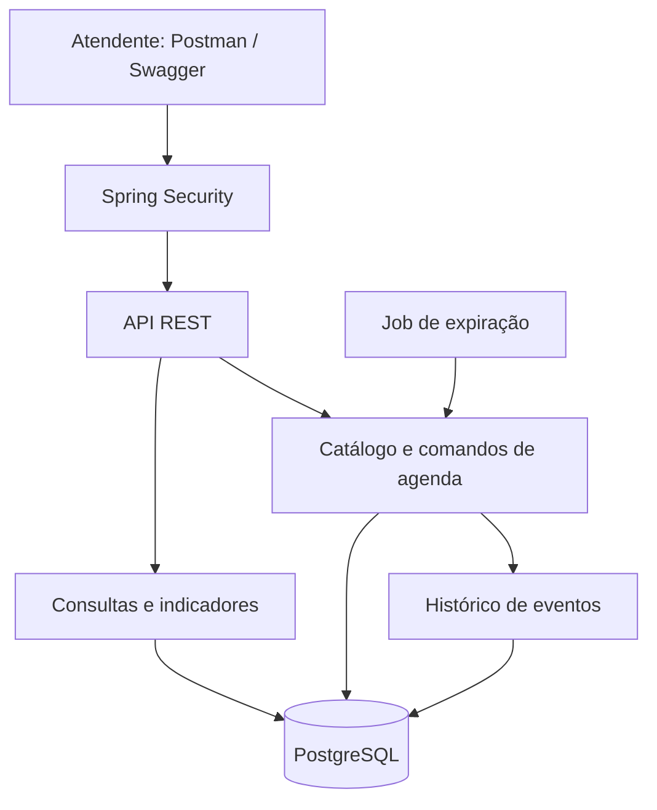
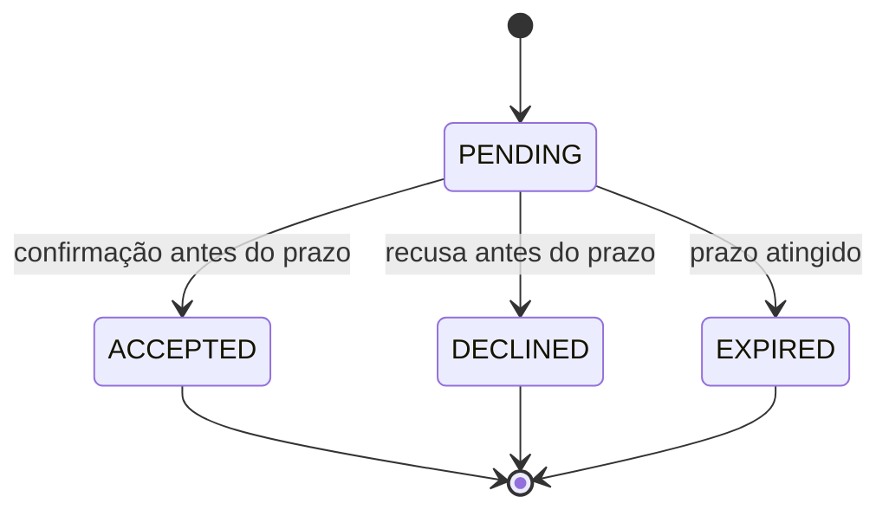

# Arquitetura e decisões

## Componentes atuais

H2 substitui o PostgreSQL apenas no perfil demo e na suíte rápida. O estado e o histórico de eventos são gravados na mesma transação. JDBC torna explícitos os comandos SQL e o bloqueio `SELECT ... FOR UPDATE`.

## Decisões registradas

| Decisão | Justificativa | Custo / limite |
|---|---|---|
| Aplicação modular única | Implantação simples e transações locais para a reserva | Módulos não têm implantação independente |
| Java 17 / Spring Boot 3.5.16 | Compatibilidade com o runtime usado na validação; versão fixada no build | Atualizações devem passar novamente pela suíte |
| PostgreSQL + Flyway | Persistência, migrações e bloqueio compartilhado entre instâncias | Banco único no Compose é ponto de falha |
| Comandos e consultas separados logicamente | Regras de escrita distintas das consultas | Banco compartilhado; leituras não escalam separadamente |
| Bloqueio por agenda | Serializa decisões de fila e vaga, mantendo FIFO sob concorrência | Reduz paralelismo dentro de uma agenda muito disputada |
| Expiração persistida + job | Retoma processamento após reinício; não depende de timer em memória | Transição visual pode levar cerca de 5s; confirmar já verifica o prazo exato |
| Histórico transacional de eventos | Rastreabilidade das mudanças | Sem reconstrução de estado ou entrega a consumidores externos |
| HTTP Basic e dois papéis | Demonstra autenticação e autorização com pouca infraestrutura | Usuários em configuração; produção exige evolução de identidade e TLS |
| Oferta via API | Demonstra o ciclo completo sem provedor externo | A comunicação com o paciente é realizada pelo atendente |

## Modelagem orientada a eventos

Este mapa foi elaborado a partir do enunciado. Não houve workshop com usuários reais.

| Ator / gatilho | Comando | Evento registrado | Consequência |
|---|---|---|---|
| Atendente | Agendar | AppointmentConfirmed | Horário BOOKED |
| Atendente | Entrar na fila | WaitlistJoined | WAITING ou oferta imediata |
| Atendente | Cancelar | AppointmentCancelled | Horário liberado; selecionar próximo |
| Política de fila | Criar oferta | OfferCreated | Horário RESERVED e entrada OFFERED |
| Atendente | Confirmar oferta | OfferAccepted / AppointmentConfirmed | Oferta ACCEPTED e entrada BOOKED |
| Atendente | Recusar oferta | OfferDeclined | Entrada DECLINED; tentar próximo |
| Job | Expirar | OfferExpired | Entrada EXPIRED; tentar próximo |

## Máquina de estados da oferta

O agendamento resultante pode ser cancelado depois; isso não altera a oferta ACCEPTED histórica. O cancelamento usa o ID do agendamento, preservando o isolamento entre ocupações sucessivas da mesma vaga.

## Concorrência e falhas

- Todas as mutações de fila/vaga bloqueiam a linha da agenda e só então releem o estado.
- Cada comando roda em transação; falhas revertem alterações e eventos no banco.
- O job processa cada agenda em uma transação própria. Duas instâncias podem identificar a mesma oferta vencida; a segunda relê o estado após o bloqueio.
- Retentativas de aceitar e cancelar devolvem o resultado histórico sem duplicar a operação.
- Cadastros e entradas em fila não possuem chave genérica de idempotência. Requisições repetidas de cadastro de paciente podem criar pacientes diferentes.
- A ordenação FIFO usa sequência gerada no banco; datas iguais não tornam a seleção ambígua.
- Ofertas nunca ultrapassam o início do horário, e horários passados não são ofertados.

## Observabilidade

Actuator: saúde e disponibilidade; Micrometer: métricas HTTP/JVM em `/actuator/prometheus`, com autenticação de operador. O log registra método, caminho, status, duração e ID da requisição retornado em `X-Request-Id`. Não registra corpo da requisição nem nomes dos pacientes.

`/api/dashboard` apresenta confirmações, cancelamentos, confirmações originadas da fila, espera e ofertas. `waitlistConfirmations` inclui vagas novas oferecidas à fila, portanto não representa exclusivamente vagas recuperadas após cancelamento. Não há medição real de impacto no SUS.

Não foram implementados tracing distribuído, dashboards Grafana, alertas ou SLOs mensurados. Logs de evento dentro da transação indicam tentativa; o registro confirmado em `domain_event` é a evidência persistente se houver rollback.

## Evolução possível

1. Validar regras e elegibilidade com profissionais de uma unidade, incluindo política de prioridades e disponibilidade do paciente.
2. Evoluir autenticação para OAuth2/OIDC, usuários reais e escopo por unidade.
3. Adicionar outbox transacional e consumidor de notificações idempotente; então extrair notificações para um serviço independente.
4. Adicionar canal real de contato e confirmação, com consentimentos e controles necessários definidos no contexto de implantação.
5. Fazer teste de carga e medir contenção; avaliar particionamento por agenda, índices e réplicas de leitura antes de ampliar infraestrutura.
6. Implantar réplicas da aplicação, banco com failover, backups testados e monitoramento, para depois estabelecer SLOs.

Esses itens são propostas futuras, não capacidades já entregues.

